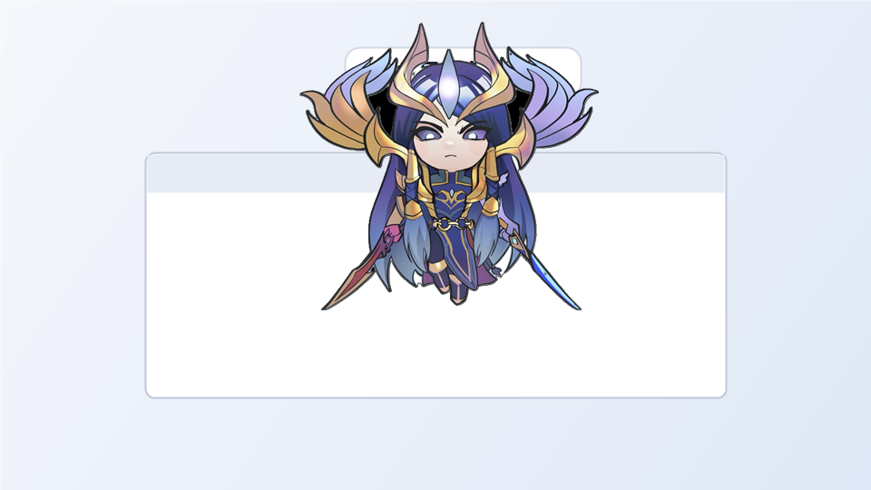
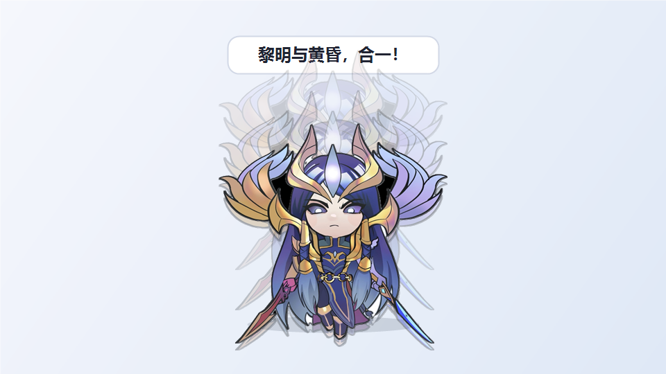

# YoneDesktopPet

一个基于 WPF 的 Windows 桌面宠物示例。角色会以透明无边框窗口悬浮在桌面上，支持拖动、缩放、随机台词、窗口吸附和缓慢降落动画。

## 预览

### 悬浮待机


### 窗口吸附



### 缓慢降临



## 功能

- 透明、无边框、默认始终置顶。
- 鼠标左键拖动角色。
- 鼠标滚轮调整大小。
- 右键菜单：调整大小、始终置顶开关、退出程序。
- 平时轻微悬浮飘动。
- 点击后升高、短暂停留，再缓慢降落回原地。
- 点击台词会在角色升到最高点、准备降落时弹出。
- 支持吸附到其他窗口顶部或左右侧边。
- 被吸附窗口移动时角色跟随。
- 被吸附窗口关闭、最小化或隐藏后，角色缓慢降落回桌面。

## 运行环境

- Windows 10/11
- .NET 7 SDK

## 素材说明

本仓库包含一张示例角色图片 `Assets/yone.jpg`，用于展示和直接运行项目。

注意：代码使用 MIT License，但角色图片、游戏角色、皮肤名称、台词等可能属于各自权利方，不属于本仓库代码许可证授权范围。

如果要替换为自己的角色图片，请把图片放到：

```text
Assets/yone.jpg
```

支持黑底 JPG，程序会在运行时尝试把连通黑色背景处理为透明。透明 PNG 可以按同样路径改名后使用，但当前项目文件默认引用的是 `Assets/yone.jpg`。

## 本地构建

```powershell
dotnet build -c Release
```

## 发布单文件 EXE

```powershell
dotnet publish -c Release -r win-x64 --self-contained true /p:PublishSingleFile=true /p:IncludeNativeLibrariesForSelfExtract=true /p:EnableCompressionInSingleFile=true -o publish_yone
```

发布后运行：

```text
publish_yone/YoneDesktopPet.exe
```

也可以在 GitHub Releases 页面下载已经发布好的 Windows 单文件 EXE。

## 台词规则

点击和待机随机台词来自完整台词池。

窗口吸附成功时固定使用：

- 疾风亦有归途

被吸附窗口关闭、最小化或隐藏后的缓慢降落会从以下台词中随机选择：

- 一剑诛恶，一剑镇魂！
- 我就是给你的天罚！
- 神性解封！
- 黎明与黄昏，合一！

## 目录结构

```text
YoneDesktopPet/
├─ App.xaml
├─ App.xaml.cs
├─ MainWindow.xaml
├─ MainWindow.xaml.cs
├─ YoneDesktopPet.csproj
├─ docs/
│  └─ screenshots/
└─ Assets/
   ├─ README.md
   ├─ yone.jpg
   └─ 向左飞行.png
```

## 许可证

代码使用 MIT License。图片、角色名称、游戏相关素材和台词不属于本仓库代码许可证授权范围。

本项目是个人学习和桌面小工具示例项目，与 Riot Games 或 League of Legends 没有官方关联。
